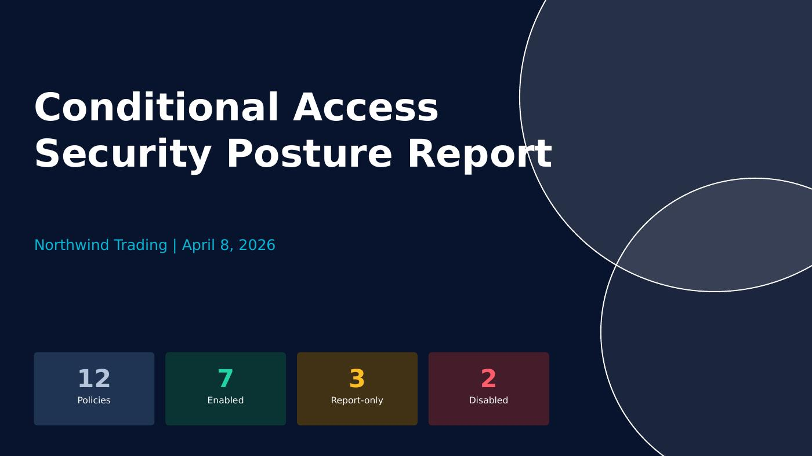
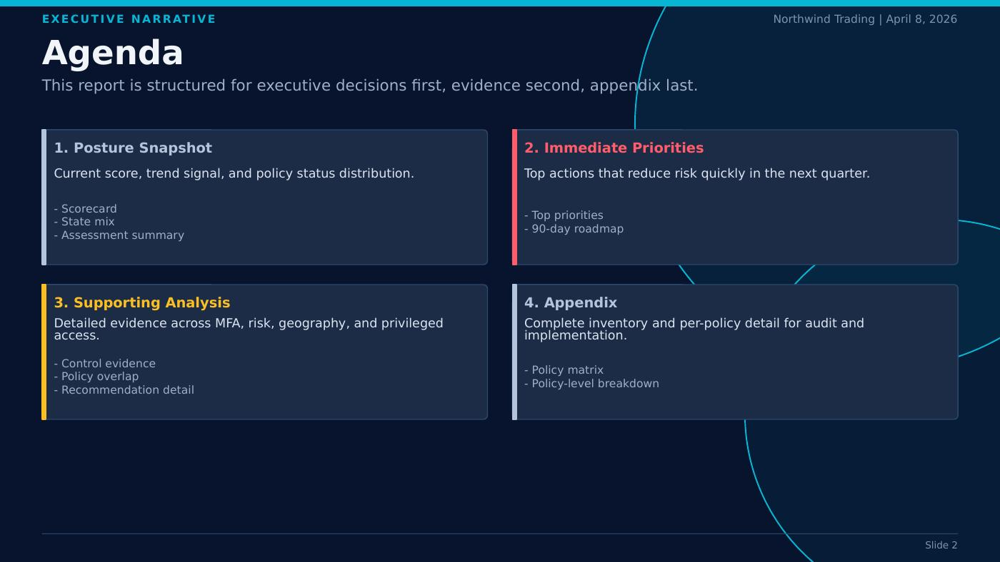
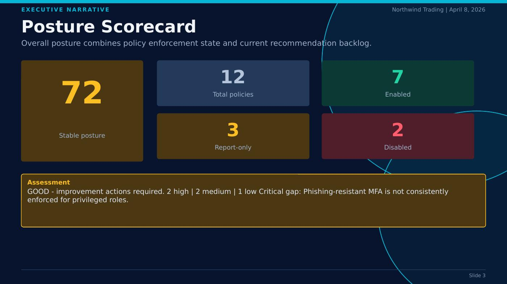
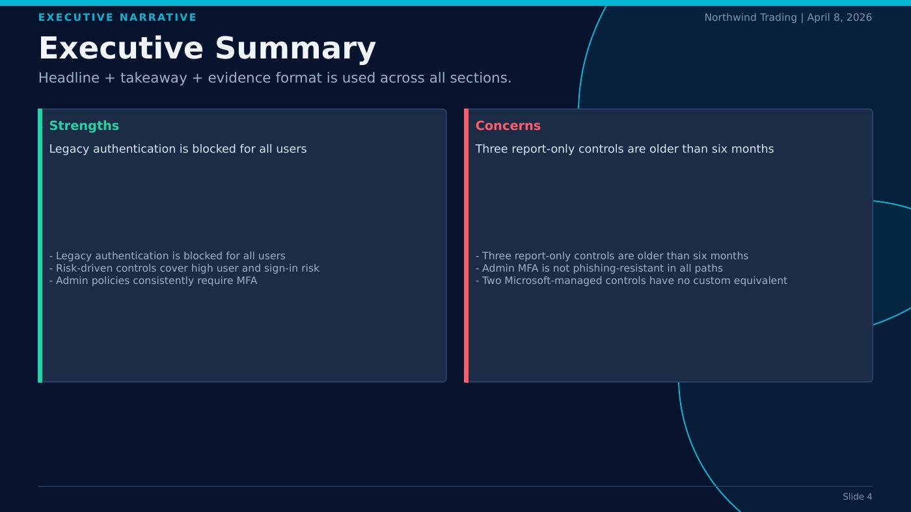

# CA Documenter

CA Documenter turns Microsoft Entra Conditional Access exports into a client-ready executive presentation with supporting appendix detail.

## Who It Is For

- Security consultants delivering posture briefings
- Internal IAM teams preparing stakeholder updates
- Managed service teams standardizing CA review output

## Inputs

Required:
- `policies.json` (Graph envelope, array, or normalized policy list)

Optional enrichment:
- Named locations
- Authentication strengths
- PIM role assignments

Analysis is captured in `analysis.json` using [`skill/analysis-schema.md`](skill/analysis-schema.md).

## Output

- Executive-first PowerPoint deck (`.pptx`)
- Optional PDF + JPG slide previews via QA render workflow

## Quick Start

```bash
npm install

# Generate from your own analysis.json + policies.json in project root
npm run generate

# Generate sanitized sample output bundle
npm run generate:example
npm run qa:render
npm run qa:slides
```

## Sample Slides

After running `npm run qa:render`, preview images are written to `docs/previews/`.






## Sample Output Bundle

- PPTX: `examples/sample/CA_Security_Posture_Report.sample.pptx`
- PDF (if `soffice` available): `examples/sample/CA_Security_Posture_Report.sample.pdf`
- Previews (if `pdftoppm` available): `docs/previews/slide-*.jpg`

## Key Project Files

- [`skill/generate_report.js`](skill/generate_report.js): themed presentation generator
- [`skill/theme.default.js`](skill/theme.default.js): default visual theme tokens
- [`skill/SKILL.md`](skill/SKILL.md): analysis workflow instructions
- [`skill/analysis-schema.md`](skill/analysis-schema.md): analysis contract
- [`skill/examples/`](skill/examples): sanitized sample inputs
