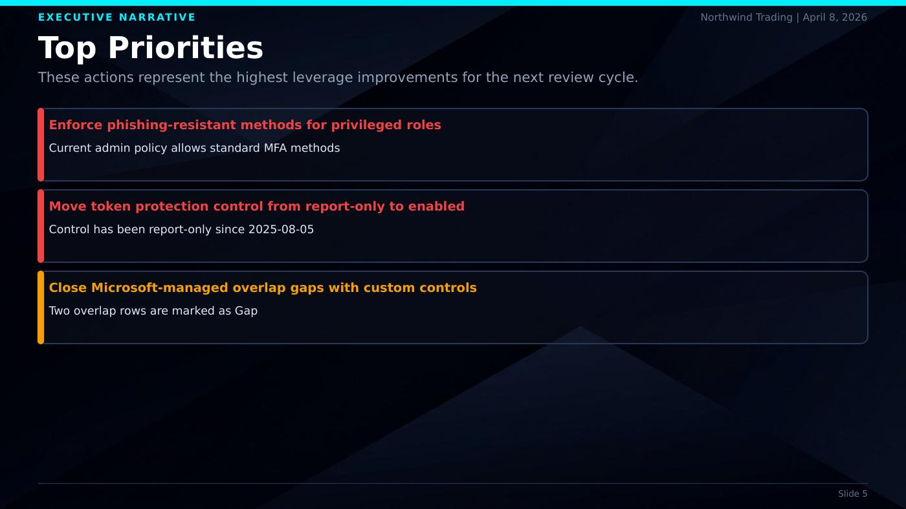
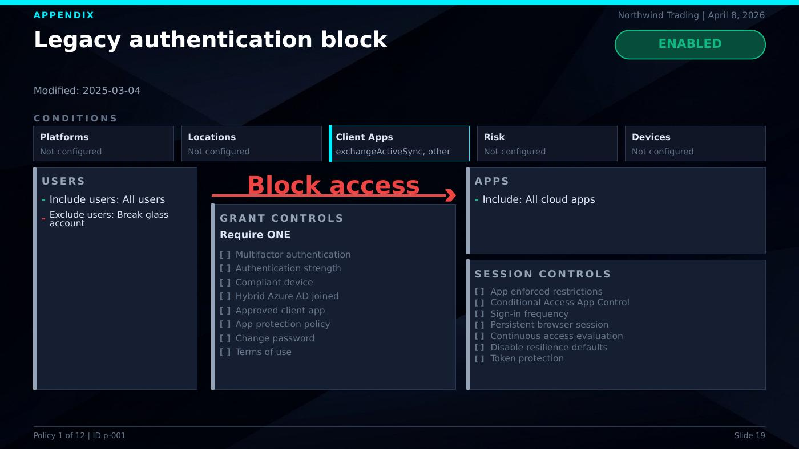
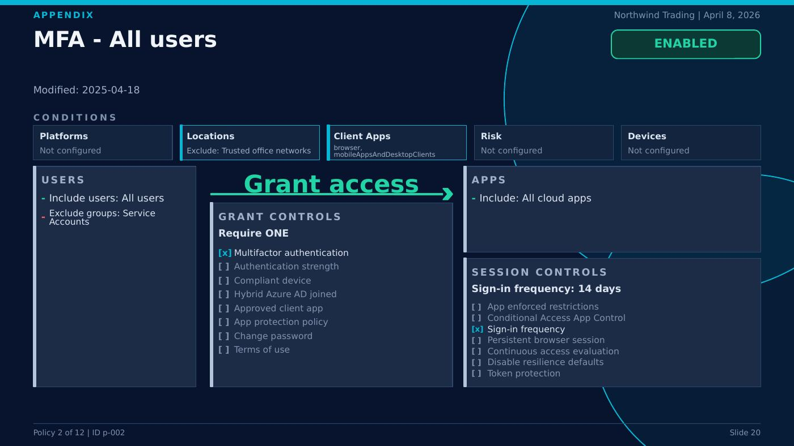

# CA Documenter

Stop spending hours manually building Conditional Access review decks. CA Documenter reads your Microsoft Entra CA policy exports and generates a polished, executive-ready PowerPoint presentation — complete with posture scoring, prioritized recommendations, and per-policy detail breakdowns.

## The Problem

Reviewing Conditional Access policies means digging through JSON exports, cross-referencing grant controls, session controls, user scopes, and app targets across dozens of policies. Turning that into something a CISO or client stakeholder can act on takes hours of slide-building every engagement.

## What This Does

CA Documenter takes your raw policy export and a structured analysis, then generates a 30+ slide presentation that covers:

- **Posture scorecard** with enforcement state distribution
- **Executive summary** with strengths, concerns, and top priorities
- **90-day roadmap** with near-term and mid-term actions
- **Supporting analysis** across MFA, geolocation, risk controls, auth strengths, PIM coverage, report-only pipeline, and Microsoft-managed overlap
- **Full policy matrix** for audit reference
- **Per-policy detail slides** showing users, apps, conditions, grant controls, and session controls at a glance

The output is themed, paginated, and structured for executive decisions first, evidence second, appendix last.

## Who It Is For

- Security consultants delivering CA posture briefings
- Internal IAM teams preparing stakeholder updates
- Managed service providers standardizing CA review deliverables

## Sample Output

### Cover


### Posture Scorecard


### Top Priorities


### Policy Detail — Block


### Policy Detail — Grant


## Quick Start

```bash
npm install

# Generate from your own analysis.json + policies.json in project root
npm run generate

# Generate sanitized sample output bundle
npm run generate:example
npm run qa:render
npm run qa:slides
```

## Inputs

Required:
- `policies.json` — Graph API envelope, raw array, or normalized policy list

Optional enrichment (included in `analysis.json`):
- Named locations
- Authentication strengths
- PIM role assignments

The analysis structure is defined in [`skill/analysis-schema.md`](skill/analysis-schema.md).

## Output

- Themed PowerPoint deck (`.pptx`) — ready to present or share
- Optional PDF + JPG slide previews via QA render workflow (`soffice` + `pdftoppm`)

## Theming

Pass a custom JSON theme file to override colors, fonts, spacing, and metadata:

```bash
node skill/generate_report.js --theme my-theme.json
```

See [`skill/theme.default.js`](skill/theme.default.js) for the full set of tokens.

## Key Project Files

- [`skill/generate_report.js`](skill/generate_report.js) — themed presentation generator
- [`skill/theme.default.js`](skill/theme.default.js) — default visual theme tokens
- [`skill/SKILL.md`](skill/SKILL.md) — analysis workflow instructions
- [`skill/analysis-schema.md`](skill/analysis-schema.md) — analysis JSON contract
- [`skill/examples/`](skill/examples) — sanitized sample inputs
